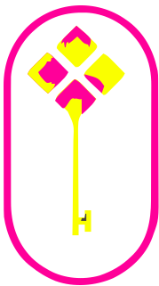

<!-- Improved compatibility of back to top link: See: https://github.com/othneildrew/Best-README-Template/pull/73 -->
<a name="readme-top"></a>
<!--
*** Thanks for checking out the Best-README-Template. If you have a suggestion
*** that would make this better, please fork the repo and create a pull request
*** or simply open an issue with the tag "enhancement".
*** Don't forget to give the project a star!
*** Thanks again! Now go create something AMAZING! :D
-->


<!-- PROJECT SHIELDS -->
<!--
*** I'm using markdown "reference style" links for readability.
*** Reference links are enclosed in brackets [ ] instead of parentheses ( ).
*** See the bottom of this document for the declaration of the reference variables
*** for contributors-url, forks-url, etc. This is an optional, concise syntax you may use.
*** https://www.markdownguide.org/basic-syntax/#reference-style-links
-->
[![Contributors][contributors-shield]][contributors-url]
[![Forks][forks-shield]][forks-url]
[![Stargazers][stars-shield]][stars-url]
[![Issues][issues-shield]][issues-url]
[![MIT License][license-shield]][license-url]
[![LinkedIn][linkedin-shield]][linkedin-url]


<!-- PROJECT LOGO -->
<br />
<div align="center">
  <a href="https://github.com/utkarshdagoat/KeyShard">
    
  </a>

<h3 align="center">KeyShard</h3>

  <p align="center">
     <b>KeyShard</b> facilitates distributed key generation using <b>FROST</b>, a threshold Schnorr signature scheme. Participants contribute to a multi-party computation protocol, generating key shares without learning the complete secret. Made on top of the <b><a href="https://fluence.dev/">Fluence Netowork</a></b> providing decentralized serverless compute/
    <br />
    <a href="https://github.com/github_username/KeyShard"><strong>Explore the docs »</strong></a>
    <br />
    <br />
    <a href="https://github.com/github_username/KeyShard">View Demo</a>
    ·
    <a href="https://github.com/github_username/KeyShard/issues/new?labels=bug&template=bug-report---.md">Report Bug</a>
    ·
    <a href="https://github.com/github_username/KeyShard/issues/new?labels=enhancement&template=feature-request---.md">Request Feature</a>
  </p>
</div>


<!-- TABLE OF CONTENTS -->
<details>
  <summary>Table of Contents</summary>
  <ol>
    <li>
      <a href="#about-the-project">About The Project</a>
      <ul>
        <li><a href="#built-with">Built With</a></li>
      </ul>
    </li>
    <li>
      <a href="#getting-started">Getting Started</a>
      <ul>
        <li><a href="#prerequisites">Prerequisites</a></li>
        <li><a href="#installation">Installation</a></li>
      </ul>
    </li>
    <li><a href="#usage">Usage</a></li>
    <li><a href="#roadmap">Roadmap</a></li>
    <li><a href="#contributing">Contributing</a></li>
    <li><a href="#license">License</a></li>
    <li><a href="#contact">Contact</a></li>
    <li><a href="#acknowledgments">Acknowledgments</a></li>
  </ol>
</details>


<!-- ABOUT THE PROJECT -->
## About The Project

![Product Name Screen Shot][product-screenshot]

Centralized key management poses a serious risk to the cryptocurrency industry. Frequently, the private key used to transfer enormous sums of money is held by just one person. Because of this, hackers have an allure because it just takes <strong>one point of compromise</strong> to cause a disastrous loss.

<b>FROST</b> and other DKG protocols provide a workaround. The secure severless compute layer of Fluence, which guarantees no secret leaks, is leveraged by <b>KeyShard</b>, a DKG application based on the Fluence network, to address this difficulty. KeyShard uses FROST to generate threshold keys so that no participant ever knows the whole secret. High-value crypto transaction security is greatly increased as a result of the distribution of trust and the removal of the centralized attack vector.

<p align="right">(<a href="#readme-top">back to top</a>)</p>

## Understanding KeyShard

### Understanding FROST(Flexible Round-Optimized Schnorr Threshold Signatures)
Here is the algorithm from the research paper

![Product Name Screen Shot][frost-screenshot]

<!-- GETTING STARTED -->
## Getting Started

This is an example of how you may give instructions on setting up your project locally.
To get a local copy up and running follow these simple example steps.

### Prerequisites

* Fluence cli
  ```sh
  curl -qsL https://raw.githubusercontent.com/fluencelabs/cli/main/install.sh | bash
  ```
<b>Ensure your node version is 18.x</b>

### Installation


1. Clone the repo
   ```sh
   git clone https://github.com/utkarshdagoat/KeyShard.git && cd keyShard
   ```
2. Start the local chain enviorment
   ```sh
   fluence local up
   ```
3. Build and deploy
   ```sh
   fluence build && fluence deploy myDeployment
   ```
4. Run the Gateway
   ```sh
   cd src/gateway && npm i && npm start
   ```
5. Run the frontend
   ```sh
   cd src/frontend && yarn && yarn dev
   ```
######  Voila! now keyShard Should be running on localhost:5173

<p align="right">(<a href="#readme-top">back to top</a>)</p>


<!-- USAGE EXAMPLES -->
## Usage

Use this space to show useful examples of how a project can be used. Additional screenshots, code examples and demos work well in this space. You may also link to more resources.

_For more examples, please refer to the [Documentation](https://example.com)_

<p align="right">(<a href="#readme-top">back to top</a>)</p>


<!-- ROADMAP -->
## Roadmap

- [ ] Feature 1
- [ ] Feature 2
- [ ] Feature 3
    - [ ] Nested Feature

See the [open issues](https://github.com/github_username/KeyShard/issues) for a full list of proposed features (and known issues).

<p align="right">(<a href="#readme-top">back to top</a>)</p>


<!-- CONTRIBUTING -->
## Contributing

Contributions are what make the open source community such an amazing place to learn, inspire, and create. Any contributions you make are **greatly appreciated**.

If you have a suggestion that would make this better, please fork the repo and create a pull request. You can also simply open an issue with the tag "enhancement".
Don't forget to give the project a star! Thanks again!

1. Fork the Project
2. Create your Feature Branch (`git checkout -b feature/AmazingFeature`)
3. Commit your Changes (`git commit -m 'Add some AmazingFeature'`)
4. Push to the Branch (`git push origin feature/AmazingFeature`)
5. Open a Pull Request

<p align="right">(<a href="#readme-top">back to top</a>)</p>


<!-- LICENSE -->
## License

Distributed under the MIT License. See `LICENSE.txt` for more information.

<p align="right">(<a href="#readme-top">back to top</a>)</p>


<!-- CONTACT -->
## Contact

Your Name - [@twitter_handle](https://twitter.com/twitter_handle) - email@email_client.com

Project Link: [https://github.com/github_username/KeyShard](https://github.com/github_username/KeyShard)

<p align="right">(<a href="#readme-top">back to top</a>)</p>


<!-- ACKNOWLEDGMENTS -->
## Acknowledgments

* []()
* []()
* []()

<p align="right">(<a href="#readme-top">back to top</a>)</p>


<!-- MARKDOWN LINKS & IMAGES -->
<!-- https://www.markdownguide.org/basic-syntax/#reference-style-links -->
[contributors-shield]: https://img.shields.io/github/contributors/utkarshdagoat/KeyShard.svg?style=for-the-badge
[contributors-url]: https://github.com/utkarshdagoat/KeyShard/graphs/contributors
[forks-shield]: https://img.shields.io/github/forks/utkarshdagoat/KeyShard.svg?style=for-the-badge
[forks-url]: https://github.com/utkarshdagoat/KeyShard/network/members
[stars-shield]: https://img.shields.io/github/stars/utkarshdagoat/KeyShard.svg?style=for-the-badge
[stars-url]: https://github.com/utkarshdagoat/KeyShard/stargazers
[issues-shield]: https://img.shields.io/github/issues/utkarshdagoat/KeyShard.svg?style=for-the-badge
[issues-url]: https://github.com/utkarshdagoat/KeyShard/issues
[license-shield]: https://img.shields.io/github/license/utkarshdagoat/KeyShard.svg?style=for-the-badge
[license-url]: https://github.com/utkarshdagoat/KeyShard/blob/master/LICENSE.txt
[linkedin-shield]: https://img.shields.io/badge/-LinkedIn-black.svg?style=for-the-badge&logo=linkedin&colorB=555
[linkedin-url]: https://linkedin.com/in/linkedin_username
[product-screenshot]: images/image.png
[frost-screenshot]: images/frost.png
[Next.js]: https://img.shields.io/badge/next.js-000000?style=for-the-badge&logo=nextdotjs&logoColor=white
[Next-url]: https://nextjs.org/
[React.js]: https://img.shields.io/badge/React-20232A?style=for-the-badge&logo=react&logoColor=61DAFB
[React-url]: https://reactjs.org/
[Vue.js]: https://img.shields.io/badge/Vue.js-35495E?style=for-the-badge&logo=vuedotjs&logoColor=4FC08D
[Vue-url]: https://vuejs.org/
[Angular.io]: https://img.shields.io/badge/Angular-DD0031?style=for-the-badge&logo=angular&logoColor=white
[Angular-url]: https://angular.io/
[Svelte.dev]: https://img.shields.io/badge/Svelte-4A4A55?style=for-the-badge&logo=svelte&logoColor=FF3E00
[Svelte-url]: https://svelte.dev/
[Laravel.com]: https://img.shields.io/badge/Laravel-FF2D20?style=for-the-badge&logo=laravel&logoColor=white
[Laravel-url]: https://laravel.com
[Bootstrap.com]: https://img.shields.io/badge/Bootstrap-563D7C?style=for-the-badge&logo=bootstrap&logoColor=white
[Bootstrap-url]: https://getbootstrap.com
[JQuery.com]: https://img.shields.io/badge/jQuery-0769AD?style=for-the-badge&logo=jquery&logoColor=white
[JQuery-url]: https://jquery.com 